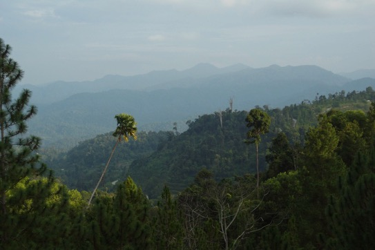
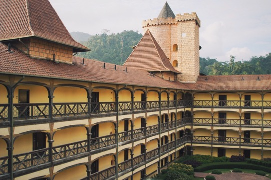
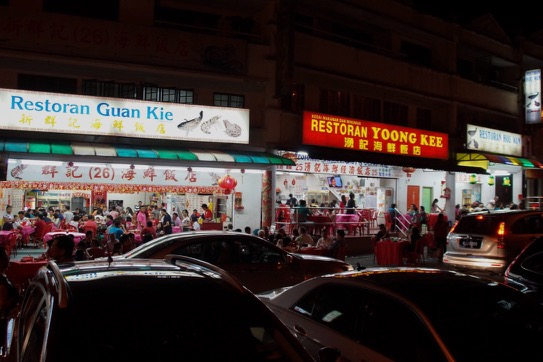

The towers suddenly spring into view, after a bend on the road. Two pointy roofs and ocre brick walls, jutting out from the palm trees and banyan trees. They look vaguely Germanic, and certainly a little out of place. Soon the rest of the Chateau comes into view, a French-themed luxury resort in the middle of the Malaysian tropical rainforest.

It's a convincing replica, more of a medieval convent rather than a castle, with exposed wooden beams, an inner courtyard and brickwork everywhere. Further down the road is Colmar Tropicale, a replica of the town of Colmar. Inevitably, the whole suffers a bit of the "uncanny valley" phenomenon, but the effect is actually fairly convincing. This is also largely due to the mountain setting. While still tropical, the altitude makes for fast-shifting weather patterns, and occasionally clouds drift in below us, lending the whole scenery a fairy tale look.

An "exotic holiday" is high on the wish list of many people. If those words triggered images of faraway sun-soaked beaches lined with palm trees and coral blue water, chances are you live in the temperate climes of the Western hemisphere. But exotic is obviously defined in opposition to the everyday. So, what when palm trees and sunny beaches are the everyday, or at least not that far away? French medieval castles are a good bet.

And indeed, the streets were thronged with people, mainly Asian, most likely mainland Chinese, given that we visited over the Chinese New Year's holiday. Selfie sticks were at the ready, enabling pictures in front of the clock tower and with the black swans in the moat. Higher up the mountain, the Japanese Tea Garden was a similar hit.

Of course it should be no surprise that a French, or generally European, theme attracts interest in this part of the world. The shopping malls lined with French luxury brands provide enough of an indication, and interest sometimes approaches obsessive levels.

Still, the appeal of the exotic has its limits. The resort's restaurants carry forward the French theme, with names such as L'Assiette or La Boulangerie. Their offering is mainly European, and some have the ambition to offer a French fine dining experience. However, most of them were entirely void of custom, with waiters forlornly pacing about the restaurant.

The reason quickly became clear. The local Chinese restaurants at the bottom of the mountain, open air with the corrugated roof, with the wobbly lazy Susan, plastic chairs and gas burners spitting flames next to the table, were doing a roaring trade. Noise levels were threatening to become a health hazard. A jaunt away from the quotidian is exciting and enriching, but usually, for true relaxation and enjoyment, nothing beats the comforts of the familiar.
