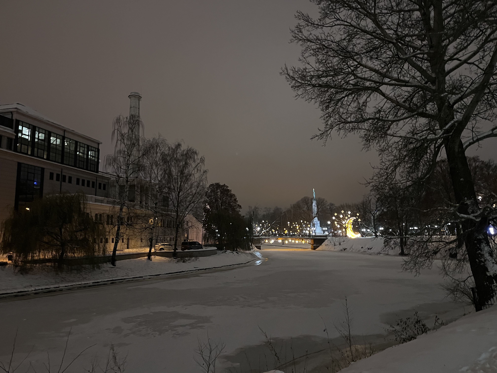

The streak didn’t survive my employer’s end-of-year offsite, as I feared. And yet, the streak absolutely achieved its aim. Let’s back up.

As a dutiful Strava user, I occasionally comply with the app’s prompts to set goals, like total running distance in the year. I’m definitely not religious about meeting these goals, but they do function as a low-key motivational tool.

Strava told me that I ran a bit more than 1,200km in 2020, and a bit more than 1,350km in 2021, despite lockdowns and quarantines. I figured 2022 would be a better year than 2021, but not even two weeks in I tested positive for Covid and ended up taking nearly two weeks off running. The winter season continued with more viral infections and quarantines for the entire family, combined with travel plans that wreaked havoc on the schedule.

Around April I noticed I ran significantly less than in 2021. There was still ample time to fix that, so in a flash of optimism, I set a goal of 1,300km in the year. For a couple of months, everything went well and the kilometers were ticking up with my usual four-runs-a-week schedule, including during a holiday in Malaysia.

Trouble resumed once back home, when on a short and easy run the day after landing, I noticed my right Achilles’ tendon started to hurt. I chalked it up to soreness from an awkward sitting position on the flight, and I continued running in the expectation that it would sort itself out in a couple of days.

A week later the pain was worse, and with significant swelling it was clear that it was an injury. Rest imposed itself, so I switched mostly to cycling for a month after that. I started running again in September, gradually building up weekly mileage, until I was derailed again by another COVID infection in early October. And for good measure, my left Achilles tendon started hurting, perhaps because I was overcompensating to spare the right one.

By mid-October, I was some 150k off the pace for the yearly goal, and, with assorted other stressors, feeling pretty down. The goal did exert a motivational effect however, and I didn’t want to abandon it. I couldn’t see how to get there with my regular schedule though. Only running four to five times a week mathematically means longer runs each time, which are harder to fit into a busy schedule, and the “cost” of missing a session is significantly higher.

So when that insight crystallised in late October, the solution was simple: just run every day. Dividing the remaining distance to the goal by the number of days left in the year would give me the daily target. At the start of the streak, the target was some 4.5km, or a small half hour of running every day.

Some days I did less than the daily target, most days more, sometimes significantly more. But I ran at least a few kilometres every day, and I wanted to keep the streak going until the end of the year. By the time my employer’s offsite rolled around, I was slightly ahead of pace, and my daily target dropped to below 3.5km a day.

The first day of the offsite went well and I got up early to run 4k in 15cm of snow and temperatures of -15C. By the evening though, I fell ill (again…), and couldn’t get out of bed the second day, let alone go for a run. So I didn’t, and the streak died. But with the holidays coming up it was clear that it would be possible to hit the target, even when missing a few more days. Eventually, I hit the 1,300km mark on the 30th of December, and the streak achieved its goal.

I’m not a huge fan of deriving universal insights from a highly individual experience such as this one, but a couple of things struck me enough that I felt compelled to write them down.

First, the power of simplicity. A specific running schedule requires daily maintenance, which can sometimes become overwhelming, especially at busy times. Running every day on the other hand couldn’t be simpler. Just get out of the door and run, every day. Sometimes I had to get up early and get the run in before the kids woke up, which required a bit of planning. Other times I had to run late at night because there hadn’t been any time during the day. But the necessary actions couldn’t be clearer: just get out there and run.

Sometimes that daily run was really a minimal effort. But that still came down to at least 3k, which meant that at the very least I wasn’t falling further behind. That’s the second insight, the power of incremental progress. None of the runs I did were longer than 12k, with most being between 5k and 7k. Nonetheless, in six weeks I went from thinking the goal was unachievable to being well on track to meet it.

In theory we all already knew this of course. But seeing the effects so clearly, in a simple setting, underlined these dynamics really vividly. More than enough to apply them with renewed ardour in a professional setting.

And as we’re now in 2023, what will the goal be for this year, you ask? Well, in another flash of optimism and confident in the power of the streak, I think I’ll aim for 1,500km…
